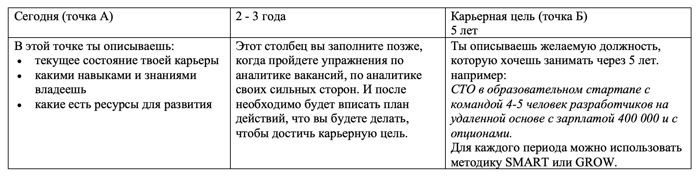

# Career track. Project 01

В данном проекте ты заложишь основу твоей карьерной траектории, определишь карьерные цели и поймешь, на что важно расставить акценты.

## Contents

1. [Chapter I](#chapter-i) \
    1.1. [Preamble](#preamble)
2. [Chapter II](#chapter-ii) \
    2.1. [General rules](#general-rules)
3. [Chapter III](#chapter-iii) \
    3.1. Карьерные приоритеты    
    3.2. Карьерная цель    
    3.3. Карьерная траектория     
4. [Chapter IV](#chapter-iv) \
    [Задача 1](#задача-1)    
5. [Chapter V](#chapter-v) 

<h2 id="chapter-i" >Chapter I</h2>

  

<h2 id="preamble">Preamble</h2> 

Любой поиск работы можно разделить на несколько этапов: 
1. Планирование; 
2. Анализ рынка; 
3. Составление резюме; 
4. Отклики;  
5. Собеседования; 
6. Анализ отказов; 
7. Сбор обратной связи; 
8. Принятие оффера.  

Но прежде чем, ты начнешь поиск работы-мечты и подходящей для тебя компании, необходимо продумать будущую карьерную траекторию. Именно с этого этапа и начинается твой профессиональный путь и твое дальнейшее развитие. 
В этом уроке ты познакомишься со всеми необходимыми этапами перед составлением резюме. 

В проекте ты сможешь:   
- сформулировать свои карьерные ценности, которые напрямую влияют на выбор будущей компании и вакансии;  
- выстроить и конкретизировать цели, на основе которых выстроишь карьерную траекторию.  

Литература:
1. [Колесо баланса](https://lifemotivation.online/razvitie-lichnosti/samorazvitie/koleso-balansa-zhizni)
2. [Что такое карьерный план](https://hh.ru/article/25406)
3. [Карьерное планирование: как продумать стратегию своего будущего](https://www.forbes.ru/forbes-woman/433215-karernoe-planirovanie-kak-produmat-strategiyu-svoego-budushchego)
4. [Как найти баланс между работой, учебой и личной жизнью?](https://ancor.ru/vacancy/advice/balans-mezhdu-rabotoy-ucheboy-i-lichnoy-zhiznyu/)
5. [Как планировать карьерный путь](https://weeek.net/ru/blog/kak-planirovat-karernyj-put)

<h2 id="chapter-ii">Chapter II</h2> 
<h2 id="genеral-rules">Genеral rules</h2>  

Методология Школы 21 может быть не похожа на тот образовательный опыт, который случался с тобой ранее. Её отличает высокий уровень автономии: у тебя есть задача, ты должен её выполнить. По большей части тебе нужно будет самому добывать знания для её решения. Второй важный момент — это peer-to-peer обучение. В образовательном процессе нет менторов и экспертов, перед которыми ты защищаешь свой результат. Ты это делаешь перед таким же учащимися, как и ты сам. У них есть чек-лист, который поможет им качественно выполнить приемку вашей работы.

Роль Школы 21 заключается в том, чтобы обеспечить через последовательность заданий и оптимальный уровень поддержки такую траекторию обучения, при которой ты не только освоишь hard skills, но и научишься самообучаться.

- Не доверяй слухам и предположениям о том, как должно быть оформлено ваше решение. Этот документ является единственным источником, к которому стоит обращаться по большинству вопросов;
- твое решение будет оцениваться другими учащимися;
- подлежат оцениванию только те файлы, которые ты выложил в GIT (ветка develop, папка src);
- в твоей папке не должно быть лишних файлов — только те, что были указаны в задании;
- не забывай, что у вас есть доступ к интернету и поисковым системам;
- обсуждение заданий можно вести и в Rocket.Chat;
- будь внимателен к примерам, указанным в этом документе — они могут иметь важные детали, которые не были оговорены другим способом;
- и да пребудет с тобой Сила!

<h2 id="chapter-iii">Chapter III</h2> 

## Колесо карьерных приоритетов 
Если у тебя нет понимания, что ты хочешь от своей работы, то поиск может затянуться на очень долгое время. Выполнение данного упражнения поможет тебе понять, на что опираться при выборе компании и вакансии. Когда у тебя будет четкое понимание, ты сможешь лучше ориентироваться в рынке труда и выбирать себе работу мечты, на которую ты будешь ходить с удовольствием.  

Поиск работы начинается с постановки вашей цели и планирования. 
Перед поиском работы можно сделать колесо карьеры с вашими критериями выбора работы:      

   

**Какие это могут быть критерии?**
- удаленная работа;  
- желаемая вилка ЗП;  
- наличие ДМС/социальный пакет;  
- коллектив и т.д;  
  

Критерии должны быть именно твоими, что важно тебе. Необходимо оценить по 10-балльной шкале, на каком этапе находится каждый критерий сейчас и к чему ты стремишься.

_Зачем это делать?_
Для того, чтобы видеть перед глазами к какой карьере ты стремишься, что ты хочешь улучшить и какие предпринимать шаги по достижению этих целей.
Расстановка приоритетов поможет тебе при составлении резюме и подбору компаний, прохождении интервью в дальнейшей карьере. Работодатели особенно обращают внимание и отмечают тех кандидатов, которые точно знают, чего хотят.
Когда ты будешь выбирать между несколькими предложениями о работе, ты всегда можешь соотнести с твоими приоритетами и правильно сделать выбор. 

[Рекомендации](https://everpracticalsolutions.com/koleso-balansa-raboti-i-drugie-tipi/) 

## Постановка карьерной цели

Постановка карьерной цели помогает разбить на шаги, которые помогут к ее достижению. Ты можешь поставить цель, например, “хочу стать лидом разработки". Эта цель звучит неплохо, но если ты не понимаешь, как ее достичь и не разбиваешь на шаги, не анализируешь, что необходимо сделать для ее реализации. Для этого есть разные методики по постановке целей. Их можно применять не только в карьерном направлении, а просто и в жизни.

Существует множество разных методик по планированию карьеры и постановки целей, которые можно использовать: 

**GROW, которую придумал Уитмор:**
- Goal — Какая у тебя цель? Чего ты хочешь добиться?
- Reality — Опиши свою ситуацию сейчас.
- Options — Какие есть варианты достижения цели? Кто может тебе помочь? Что тебе нужно? Давай проведём брейнсторминг.
- Will — Что нужно сделать для достижения цели? Какие ближайшие шаги? Когда бы ты мог это сделать?

Например: 
.  

Подробнее о [методике](https://hr-portal.ru/story/model-grow-metod-nastavnichestva)

**SMART**  

После того, как определился с целью, необходимо определиться с ценностями. Каждый человек имеет разные ценности на протяжении всего жизненного пути и в завсимости от периода жизни они имееют способность меняться. Так, можно выделить следующие ценности:  
- Автономность 
- Work-life баланс 
- Деньги
- Стабильность
- Новаторство (делаю инновационные проекты) Впечатления (поездки, новые проекты) 
- Команда 
- Социум/Экология (приношу пользу) 
- Проявление себя/Творчество и тд. 

Подробнее [“Smart”](https://in-scale.ru/blog/celi-smart/)

Понимание своих ценностей поможет определиться со списком компаний, которые тебе наиболее подходят, а так же к которым ты будешь стремиться. 

В помощь можно пройти тест на [ценности](https://onlinetestpad.com/ru/test/74311-test-cennosti-shvarca)

Для того, чтобы карьерный путь приобрел четкие планы и при этом придерживался заданному направлению, следует карьерную цель разбить на 2 периода:  

1. Первая точка отсчета “А” - сегодняшний день.   
2. Вторая точка “Б” - твоя карьерная цель на 5 лет вперед.  
Планировать карьеру больше, чем на 5 лет сложно, потому что мир сейчас меняется стремительно быстро, некоторые профессии вымирают, а другие автоматизируется, поэтому тут важно следить за своим направлением и каждый раз совершенствовать свои навыки и быть в тренде.   
3. Промежуточная точка между “А” и “Б” - 2-3 года.  

. 

Итоговый карьерный план можно нарисовать в MIRO. Там удобно разбить на периоды время и добавлять необходимые обновления в твоем индивидуальном карьерном треке. Желательно разработать пошаговый карьерный план, в котором будут отображены:  
1. Навыки, которыми ты владеешь на текущий момент;  
2. Навыки, которых недостает для карьерной цели;  
3. Решения, как достичь тех или иных навыков (найти ментора, пройти курсы, взять экспертную оценку и тд);  
4. Разбивай карьерный план на 2-3 года вперед и 4-5 лет. Не забывай каждый год сверяться со своим карьерным ростом. 

<h2 id="chapter-iv">Chapter IV</h2>  

## Задача 1 

Для решения этой задачи необходимо составить твой карьерный трек на ближайшие 3-5 лет. Для этого необходимо понять карьерные цели, ценности и составить пошаговый план реализации.  

<h2 id="chapter-v">Chapter V</h2>  

## Exercise 00 
### Колесо карьерного баланса

1. Выписать критерии выбора работы и оценить по шкале от 1 до 10, что происходит на данный момент? (от 5 и более).  
2. Сделать второе колесо с теми же критериями и оценить их снова от 1 до 10, как бы вы хотели, чтобы эти критерии выглядели в будущем?  
3. Для каждого критерия придумайте и впишите шаги действия, что вы будете делать, чтобы его достичь? 
4. Данное задание выполнить в MIRO добавить формат. Прикрепить визуализацию итоговое колесо (2 шт.) в папку src.    

## Exercise 01
### Карьерные цели

1. Сделай таблицу твоей карьерной цели на 1-2 года и 4-5 лет.   
2. В первой графе опишите текущее состояние карьеры.  
3. В третьей графе на основе ценностей и колеса карьерного баланса напиши, к каким карьерным целям через 5 лет ты стремишься, что для тебя важно в работе?
4. Вторую графу пока оставь пустой. 

>Пожалуйста, оставь обратную связь по проекту в [форме обратной связи.](https://forms.gle/KXfQ1dSUq26VkqFm7)
